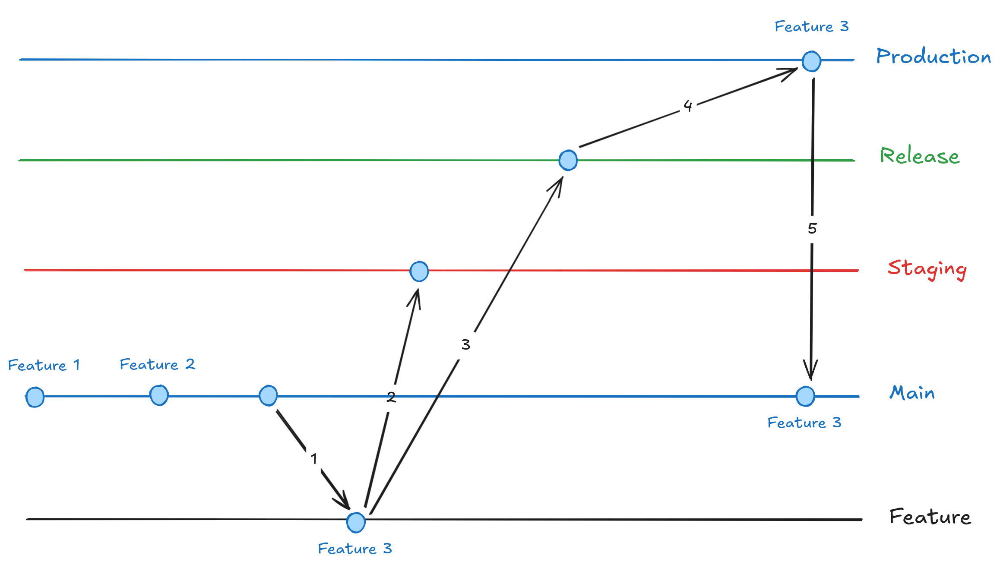

# SANBE HRMS LIVE
Project initial @2024

## Development Workflow
### 1. Branching Model
- **Main** (Stable) Merupakan stable version dari sebuah project. Branch ini akan selalu di sinkronkan dengan production setelah proses deployment ke production.
- **Feature** Merupakan duplikasi (hasil checkout) dari branch main. Tempat fitur baru dibuat oleh developer.
- **Staging** (Unstable) Merupakan branch tempat berkumpulnya semua merge dari Feature Branch. Branch ini juga merupakan tempat Q/A berlangsung.
- **Release** Merupakan tempat fitur-fitur yang sudah lolos Q/A (siap rilis) dan selanjutnya akan di merge ke Production Branch.
- **Production** Merupakan branch yang di gunakan oleh user.

### 2. Alur Kerja

**KETERANGAN**
1. Buat branch fitur baru
2. Merge feature branch ke staging branch
3. Merge feature branch ke release branch
4. Merge release branch ke main branch
5. Main branch rebase ke production branch (sinkronisasi)

**WORKFLOW**
1. Developer pindah ke main branch dan lakukan update.
   - `git checkout main`
   - `git pull origin main`
2. **Optional** - supaya commit feature branch up to date dengan staging branch.
   - `git fetch origin staging` (update)
   - `git merge staging` (menghindari solve conflict pada GitLab)
3. Setelah selesai membuat fitur, push feature branch ke remote branch.
   - `git push origin HEAD`
4. Developer buat Merge Request pada GitLab ke **staging branch**.
4. Selanjutnya akan di lakukan QA pada server development (staging branch).
5. Fitur yang lolos QA akan di beri label `QA - Approved` dan akan di merge ke release branch oleh DevOps via GitLab.
6. Release branch akan di merge ke production branch oleh DevOps via GitLab.
7. Terakhir, DevOps akan melakukan sinkronisasi antara branch production dan main branch.
   - `git checkout production`
   - `git pull origin production`
   - `git checkout main`
   - `git rebase production`
   - `git push origin main --force`